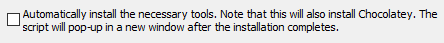

## 新机安装必备

- ps: 闲来无事 突然发现C盘下面AppData占用基本40多个G 而且这个随着时间会越来越大 所以搞一个新机设置安装的md  
  这个文档也可能其他人看 所以角度站到一个小白视角吧

### 注意事项:

电脑防护 杀毒软件 垃圾清理等软件 完全不用安装 因为普通用户对安全的要求 Windows自带的已经绰绰有余了  
除非是对于重要数据安全有较高的要求 一般用户只要软件是正版官网下载的 大部分情况下是没有问题的  
如果为了寻求心里安慰 非要安装一个软件的话 推荐安装火绒 因为比其余的软件干净太多了

## 系统设置:

- 保存位置: 现在win系统都可以修改默认的保存位置: `设置-系统-存储-更多存储设置-新内容保存位置` 修改成其他盘符
- 下载位置: 下载软件时 尽量去官网下载 也不要去microsoft store下载 官网是最新的版本 而且也可以选择适合自己的系统  
  `浏览器内设置下载位置: 设置-下载-更多设置-下载位置`
- 修改AppData位置: 这个文件夹下面的东西会越来越大 有些文件夹可以删 但是有些东西是不能删除的 最好的办法就是修改位置  
  `修改注册表教程`[修改AppData位置](https://blog.csdn.net/zsq_csh1/article/details/127484216 "修改AppData位置")

## 常用软件:

### 安装位置:

安装软件一般都选择自定义安装或者选择其他的盘符进行安装 一般来说C盘只放系统和一些必要的软件

- ps: 选择盘符的时候 需要注意一下安装的软件类型 游戏之类需要性能好一点的 盘符就选固态硬盘 反之就是机械硬盘  
  还有安装完软件之后 一般需要点开软件的设置 选择保存或者下载位置 因为默认都是c盘  
  <br/>

### Golang:

官网下载解压到某个自定义文件夹中后 配置环境变量等

- 现在go的版本通过go mod管理依赖 所以不需要再配置GOPATH了  
  但是一些老的项目 或者go install的时候不配置会下载到系统盘 所以还是配置一下吧
- 配置GOROOT系统环境变量: 变量名: `GOROOT` 变量值: go的安装路径bin目录
- 配置GOPATH系统环境变量: 新建文件夹 此文件夹下新建 `bin pkg src` 三个文件夹 变量名: `GOPATH` 变量值:
  自定义文件夹路径
    - 这样的gopath是全局的 若用gopath的模式 需要在不同项目中 切换不同的gopath(不推荐)
- go env:
    - 设置gopath: `go env -w GOPATH=D:\Golang1.19\gopath`(修改后 GOMODCACHE也会跟着修改)
    - 开启go mod: `go env -w GO111MODULE=on`
    - 设置代理: `go env -w GOPROXY=https://goproxy.io,direct`
    - 设置构建缓存: `go env -w GOCACHE=D:\Golang1.19\gopath\go-build-cache`
        - 恢复自己设置的go env: 删除 `C:\Users\%UserName%\AppData\Roaming\go\env`  
          <br/>

### Anaconda: 官网下载安装

- `I agree` 后 `install for all users`
- 创建开始菜单 base环境 清除包缓存 **_均勾选_**
- finish时 launch 等两个选项 **_不要选择_**
- 配置环境变量: path 中添加
    - `G:\anaconda`
    - `G:\anaconda\Scripts`
    - `G:\anaconda\Library\bin`
    - `G:\anaconda\Library\mingw-w64\bin`
    - `G:\anaconda\Library\usr\bin`
- 验证: `conda --version` `conda env list`
- 配置:
    - `conda config --set show_channel_urls yes` 设置搜索时显示通道地址
    - 修改 `~/.condarc` 文件:
  ``` text
  envs_dirs:
    - G:\anaconda_pkg\envs
  pkgs_dirs:
    - G:\anaconda_pkg\pkgs
  show_channel_urls: true
  channels:
    - https://mirrors.tuna.tsinghua.edu.cn/anaconda/cloud/msys2/
    - https://mirrors.tuna.tsinghua.edu.cn/anaconda/cloud/conda-forge
    - https://mirrors.tuna.tsinghua.edu.cn/anaconda/pkgs/free/
    - defaults
  ```
- 验证: `conda info`
- 删除镜像源恢复默认: `conda config --remove-key channels`  
  <br/>

- 配置激活环境:
    - `conda init` 初始化
    - `conda create -n py39 python=3.9` 创建环境
    - `conda activate py39` 激活环境  
      <br/>

- 修改pip下载位置:
    - `python -m site --user-site` `python -m site` 查看路径

- 安装pytorch:
    - cpu版本:
        - `pip install torch`
        - `pip install torchvision`

### Python:

(如果仅仅需要python环境 可以单独安装这个 建议直接安装Anaconda)

- Windows: 官网下载对应版本 `Use admin privileges 和 Add to PATH` 都要选择点击安装
- 自定义安装:
    - [ ] Documentation: 安装Python的文档和帮助文件 一般不安装 因为也不看
    - [X] pip: 安装Python包管理工具 一定要安装
    - tcl/tk and IDLE: 安装Python的GUI工具包和IDLE集成开发环境 一般不安装 因为也不用
    - [X] Python test suite: 安装Python的测试套件 后期会用到
    - [X] py launcher: 安装Python的py命令行工具 安装 可能会用到
    - advanced options:
        - [X] Associate files with Python: 将Python关联到.py文件 选择
        - [ ] Create shortcuts for installed applications: 为安装的应用程序创建快捷方式 不选择
        - [X] Add Python to environment variables: 将Python添加到环境变量 选择
        - [X] Precompile standard library: 预编译标准库 以提高标准库模块的导入速度
        - 路径: 不要带中文
    - 如果前面没有选择添加环境变量: 系统环境变量PATH中添加Python的安装路径
- 验证: `python --version` `pip --version` `py --version`
    - pip修改路径:
    - `python -m site` 查看路径  `pip show 安装包名字` 查看安装包路径
    - 在 `python/lib/site.py ` 文件中 修改
      `USER_SITE = "G:\anaconda\Lib\site-packages"`
      `USER_BASE = "G:\anaconda\Scripts"`  
      <br/>

### Node.js:

- Windows: 官网下载对应版本LTS
- 自定义安装: 其实默认安装就可以了 非必要的在线文档等功能也占用不了多少空间 仅1M左右
    - [X] runtime: 安装运行环境
    - [X] npm package manager: 安装npm包管理工具
    - [X] Add to PATH: 添加到环境变量
    -  这个不要勾选 会影响安装速度 自己安装 C/C++ & python
    - 验证: `node -v` `npm -v`
- 配置npm包的安装路径:
    - 查看路径: `npm config get prefix` `npm config get cache`
    - 手动创建文件夹: `D:\ProgramData\nodejs\node_global` `D:\ProgramData\nodejs\node_cache`
    - 修改权限: 两个文件夹可以写入
    - `npm config set prefix "D:\ProgramData\nodejs\node_global"`  
      `npm config set cache "D:\ProgramData\nodejs\node_cache"`
    - 修改环境变量: `C:\Users\lemon\AppData\Roaming\npm` --> `D:\ProgramData\nodejs\node_global`
    - 修改npm源: `npm config set registry=https://registry.npmmirror.com/`
    - 参考来源: [npm包安装路径1](https://blog.csdn.net/thefg/article/details/132410794 "npm包安装路径")
      [npm包安装路径2](https://blog.csdn.net/Nicolecocol/article/details/136788200 "npm包安装路径")  
      <br/>
  